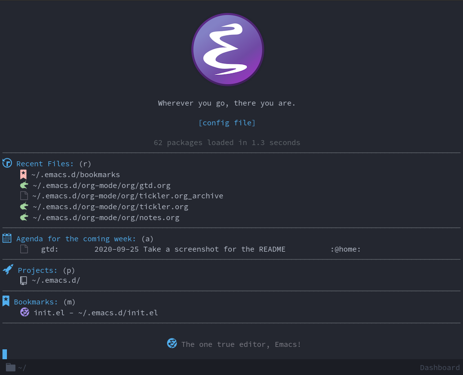

<p align="center">This repository contains my Emacs configuration.</p>
<p align="center"></p>

<blockquote>
    Modeline: <a href="https://github.com/seagle0128/doom-modeline">DOOM Modeline</a> <br>
    Theme: <a href="https://github.com/hlissner/emacs-doom-themes">DOOM Vibrant</a> <br>
    Font: <a href="https://adobe-fonts.github.io/source-code-pro">Source Code Pro</a>
</blockquote>

The most important files:

* [`config.org`](https://github.com/greensponge/.emacs.d/blob/master/config.org/):
 This is the main configuration file where all snippets are organized under categories. When changes are saved here, the generated `config.el` file will update automatically.

* [`init.el`](https://github.com/greensponge/.emacs.d/blob/master/init.el/):
  This file loads the `config.el` configuration file when Emacs starts.

# Getting started
If you're starting fresh, clone this repository into your home directory:

```
~: git clone https://github.com/greensponge/.emacs.d.git
```

If you're on Windows it can vary if you're using `WSL`, `Chocolatey` or have installed Emacs manually. In general you just have to find where your Emacs home directory lives and replace the .emacs.d folder with this one.

# First run
The first time you start this configuration it will ask you if you want to allow a local variable I have defined in `config.org` to run.
This warning only happens when the `config.el` file is first generated and you can simply press `y` to proceed.
All that the local variable does is add a `save-hook` on `config.org` that `tangles` (updates) the `config.el` file whenever `config.org` is saved.

# Getting things done (GTD)
I have configured GTD to be easily accessible for me, however, you do not have these files, because I don't have them in source control.
You will get warnings about missing files the first time you start Emacs, i.e. `gtd.org cannot be found`. You can proceed by pressing `y` to add the file to an ignored list.

# Snippets
The best way to learn might not be to clone this repository though, you probably don't like what I like. If that's the case I invite you to look at the [`config.org`](https://github.com/greensponge/.emacs.d/blob/master/config.org/) file and take what you like.

If you find something you like and want to try it out, paste it into your own configuration and press:

`C-x C-e`

With the marker/point at the end of the functions closing paranthesis.

If you're unfamiliar, this is what's called a key chord in Emacs, and it's simply a succint way to say: 

`CTRL+X CTRL+E`

